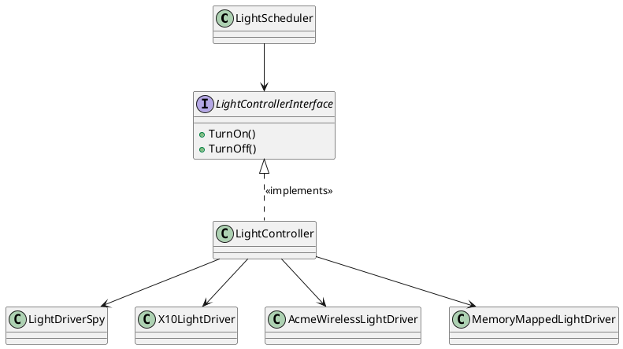
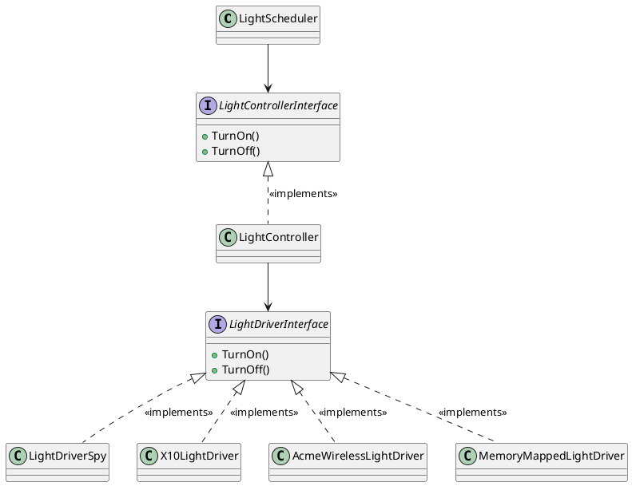

```puml
@startuml

class LightScheduler {
}

interface LightControllerInterface {
  + TurnOn()
  + TurnOff()
}

class LightController {
}

class LightDriverSpy {
}

class X10LightDriver {
}

class AcmeWirelessLightDriver {
}

class MemoryMappedLightDriver {
}

LightScheduler --> LightControllerInterface
LightControllerInterface <|.. LightController:<<implements>>
LightController --> LightDriverSpy
LightController --> X10LightDriver
LightController --> AcmeWirelessLightDriver
LightController --> MemoryMappedLightDriver

@enduml
```

---

```puml
@startuml

class LightScheduler {
}


interface LightControllerInterface {
  + TurnOn()
  + TurnOff()
}

class LightController {
}

interface LightDriverInterface {
  + TurnOn()
  + TurnOff()
}

class LightDriverSpy {
}

class X10LightDriver {
}

class AcmeWirelessLightDriver {
}

class MemoryMappedLightDriver {
}

LightScheduler --> LightControllerInterface
LightControllerInterface <|.. LightController:<<implements>>
LightController --> LightDriverInterface
LightDriverInterface <|.. LightDriverSpy:<<implements>>
LightDriverInterface <|.. X10LightDriver:<<implements>>
LightDriverInterface <|.. AcmeWirelessLightDriver:<<implements>>
LightDriverInterface <|.. MemoryMappedLightDriver:<<implements>>

@enduml
```